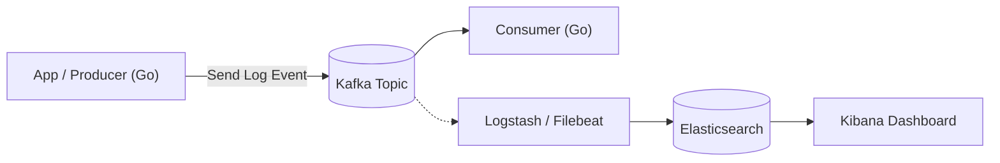

# Kafka 事件驅動範例

使用 Go 撰寫的範例，理解 Kafka 的運作機制。實際應用中，我們會用 Kafka 來收集應用程式的錯誤 log，然後存到 Elasticsearch 讓工程師查詢和除錯。

## 架構圖



## 架構說明

- **Producer**：模擬應用程式發送 log 事件到 Kafka
- **Kafka**：作為 message queue，確保 log 不會丟失
- **Consumer**：接收並顯示 log（這個只是為了展示）

## 環境需求

- Docker 和 Docker Compose
- Go 1.21 或以上版本

## 使用方式

### 1. 啟動 Kafka

```bash
make up
```

啟動 Kafka 和 Zookeeper 容器，等待服務就緒。

### 2. 啟動 Consumer（展示用）

開另一個終端：

```bash
make consumer
```

會看到：
```
Consumer 已啟動，等待訊息...
```

### 3. 啟動 Producer

再開一個終端：

```bash
make producer
```

## 預期結果

執行 `make producer` 後會看到：

```
[Producer] Sent message: user_registered
```

Consumer 終端會顯示：

```
[Consumer] Received message: user_registered
[Consumer] Processed successfully
```

## 專案結構

```
go-kafka-event-demo/
├── README.md
├── Makefile
├── docker-compose.yml
├── go.mod
├── producer/
│   └── main.go
└── consumer/
    └── main.go
```

## 技術規格

- **Kafka 版本**: latest (Bitnami)
- **Go 函式庫**: github.com/segmentio/kafka-go
- **Topic 名稱**: `demo-topic`
- **Consumer Group**: `demo-group`
- **Kafka 位址**: `localhost:9092`

## 可用指令

- `make up` - 啟動 Kafka 和 Zookeeper
- `make down` - 停止並清理容器
- `make consumer` - 啟動 Consumer
- `make producer` - 啟動 Producer
- `make clean` - 清理所有資料
- `make status` - 顯示容器狀態

### 重建環境
完全清理並重建：
```bash
make clean
make up
```

## 免責聲明
*本專案僅供學習使用，執行指令前請先了解各指令的作用。*